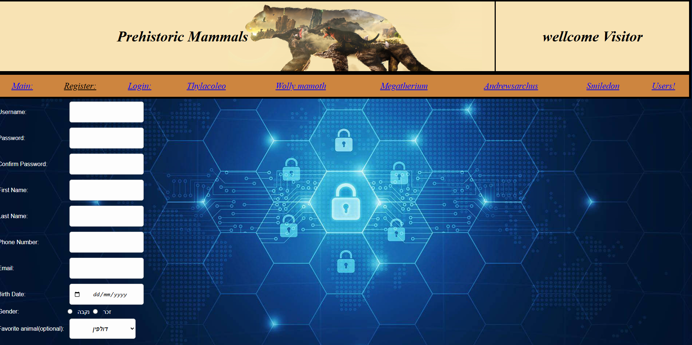
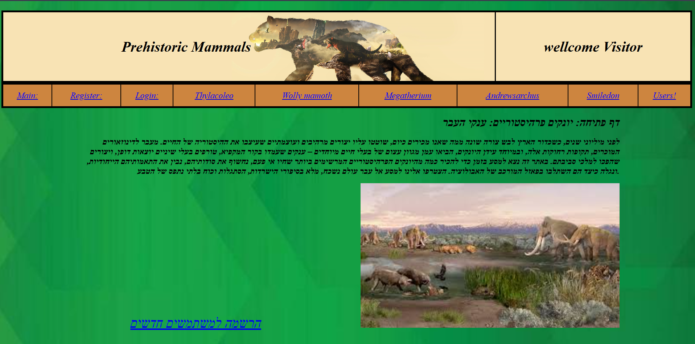
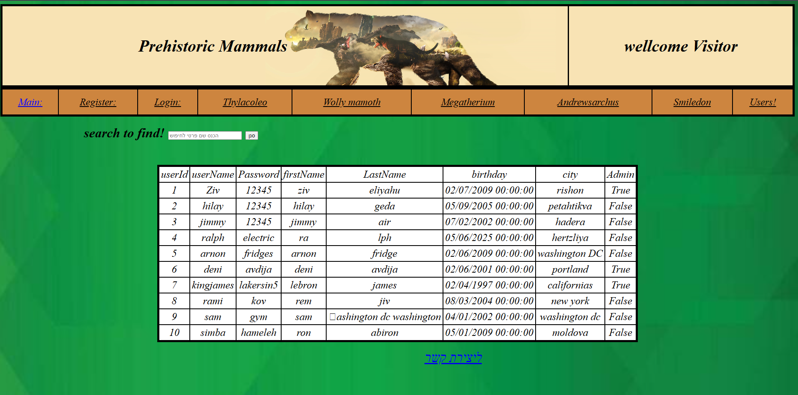

#  Prehistoric World Explorer
### **Visual Studio ASP.NET | My First Web Project (Age 15)**

This project was my first deep dive into web development and server-side logic. Driven by my passion for prehistoric creatures, I built this system to catalog and display information about ancient life.

---

##  Project Showcase

---

##  Technical Implementation
This project was developed using the **ASP.NET framework** and showcases the following:
*   **Web Forms & ASPX:** Implementation of dynamic pages using `.aspx` and C# code-behind.
*   **Structured Project Architecture:** Separation of concerns with folders like `App_Data`, `CSS`, and `JS`.

---
> Developed by **ZivDevelop** - A look back at my coding journey.
